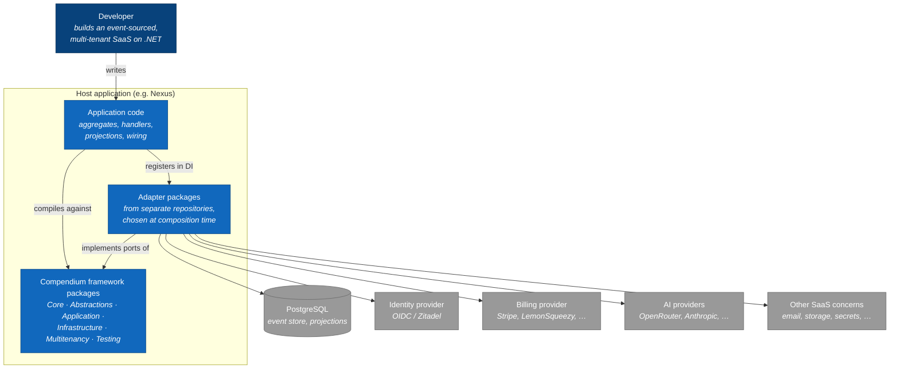

# C4 — Level 1: System context

Compendium is a set of NuGet packages, not a running system. The context view
therefore shows the framework **as seen from a consuming application**: who builds
with it, what it links into the application, and which external systems stay on the
other side of an adapter.

## Reading notes (faithful to the code)

- **The framework never talks to an external system itself.** Every arrow to the
  bottom row goes through an adapter package implementing a port from
  `Compendium.Abstractions.*`. The framework repo contains no vendor SDK on the
  hot path — the heavy adapters were extracted to their own repositories
  ([ADR-0006](../adr/0006-multi-repo-adapter-split.md)).
- **The host application is a real participant, not a passive consumer.** It owns
  the aggregates and handlers, but also the aggregate rehydration logic
  (`EventSourcedRepository` leaves it abstract) and most of the DI wiring — there is
  no umbrella `AddCompendium()` extension.
- **Nexus** ([sassy.solutions](https://sassy.solutions)) is the reference consumer;
  the framework was extracted from it and is exercised by it in production.
- Without any adapter package, the framework still runs end-to-end on its own
  in-memory implementations — that is how the framework's integration test suite
  works ([ADR-0007](../adr/0007-integration-test-split.md)), and a legitimate way to
  start a project before choosing infrastructure.

Next: [Level 2 — containers (packages)](c4-level2-containers.md)
