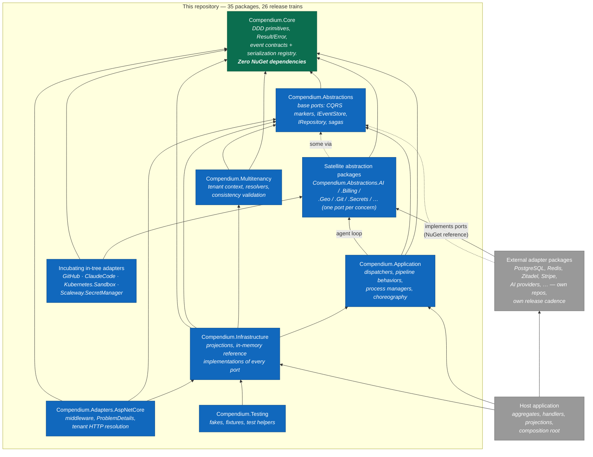

# C4 — Level 2: Containers

For a framework, the "containers" are its **publishable units**: the NuGet packages
this repository ships, plus the two things that sit outside it — the host
application and the externally-hosted adapter packages. Every arrow below is an
actual `ProjectReference` (or NuGet reference) in the code; the direction is
enforced for the four main assemblies by the architecture tests in
`tests/Architecture/`.

## Reading notes (faithful to the code)

- **Dependencies point inward, toward Core.** The architecture tests
  (`HexagonalLayeringTests`) verify ten "must not depend on" rules across Core,
  Abstractions, Application and Infrastructure. Honest caveat: the test project
  loads only those four assemblies — Multitenancy, the satellite abstractions and
  the in-tree adapters are not covered by those tests today.
- **`Compendium.Application` → `Compendium.Abstractions.AI` is a real edge**, not a
  mistake in the diagram: the AI agent-loop contracts are consumed by Application,
  which is why `Abstractions.AI` rides the `core-v` release train with the ten
  interdependent packages.
- **`Infrastructure` depends on `Application` and `Multitenancy`** — it is the outer
  of the two middle rings, hosting orchestration-aware building blocks
  (`LiveProjectionProcessor` is a `BackgroundService`) and tenant-prefixed
  in-memory stores.
- **Satellite abstractions are deliberately tiny and independent**: 18 of them are
  leaf packages with their own release train each, so tagging `geo-v1.0.6` ships
  `Compendium.Abstractions.Geo` and nothing else (see
  [release trains](../operations/release-trains.md)).
- **The in-tree adapters are the exception, not the rule**: `AspNetCore` stays
  because it has no external SDK and evolves lock-step with the framework; the four
  others incubate here until their abstraction ships a stable tag
  ([ADR-0006](../adr/0006-multi-repo-adapter-split.md)).

Next: [Level 3 — components of the core flow](c4-level3-components.md)
