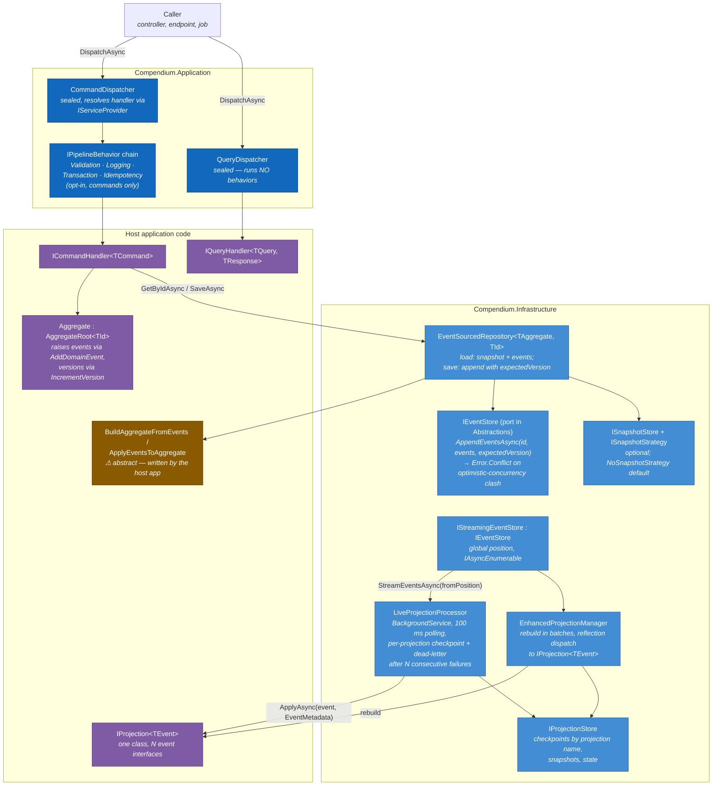
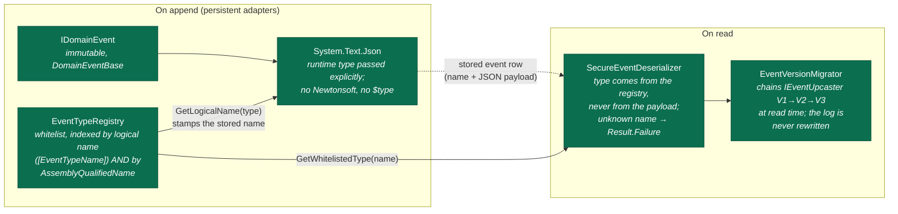

# C4 — Level 3: Components of the core flow

This view maps the components that a command actually traverses in the code — from
dispatch to event append to projection — plus the event-serialization machinery and
the saga components. Types are named exactly as they appear in the source; the two
deliberate ruptures in the flow (places where the framework hands responsibility to
the host application) are marked.

## Write side and read side

The dispatchers and the behavior pipeline are the framework's own — no mediator
dependency; the reasoning is in [ADR-0012](../adr/0012-hand-rolled-cqrs-dispatch.md).

**The rupture to know about:** after `AppendEventsAsync` succeeds, **nothing is
dispatched automatically**. There is no in-process domain-event dispatcher
(`IDomainEventHandler<T>` exists but no component invokes it), and projections only
see events because `LiveProjectionProcessor` independently polls the streaming
store. The write path and the read path meet in the store, not in a bus.

## Event serialization and schema evolution (`Compendium.Core.EventSourcing`)

Reading notes:

- The registry's double indexing means a log holding both old
  (assembly-qualified-name) rows and new (logical-name) rows is readable by a single
  binary, without rewriting anything. Name collisions are refused at registration —
  *"a payload deserialized into the wrong type is worse than one not deserialized at
  all"* (`EventTypeRegistry.cs`). Rationale and trade-offs:
  [ADR-0010](../adr/0010-logical-event-identity.md) and
  [ADR-0011](../adr/0011-whitelist-deserialization-upcasting.md).
- A stream containing one unresolvable event type fails **as a whole**
  (`EventStore.EventTypeUnresolved`) rather than returning a truncated history as a
  success.
- Honest caveats: the in-memory stores keep live `IDomainEvent` instances and never
  exercise the deserialization path — only persistent adapters (separate repos) do;
  event registration is manual (`RegisterEventType`), and the
  `IGeneratedEventRegistry`/`[AutoRegisterEvent]` compile-time story has no source
  generator behind it yet; a missing upcaster is not detected — the event passes
  through unchanged.

## Sagas and integration events

Two explicit flavors, named so you know which pattern you are using
(see [docs/sagas.md](../sagas.md)):

- **Orchestration** — `ProcessManager<TState>` (step state machine) driven by
  `ProcessManagerOrchestrator`, persisting through `IProcessManagerRepository`
  (in-memory implementation provided) and executing business steps through
  `IProcessManagerStepExecutor` — which has **no implementation in this repo**: it
  is the mandatory extension point of the host application. Compensation is
  explicit, never automatic.
- **Choreography** — `IHandle<TEvent>` handlers fanned out by `ChoreographyRouter`
  over `IIntegrationEvent`s published through `IIntegrationEventPublisher`. The
  in-memory publisher is provided; a durable one (outbox) is an adapter concern and
  **does not live in this repository**.

**The second rupture:** nothing bridges the `IDomainEvent` world (event store,
projections) to the `IIntegrationEvent` world (choreography). Publishing an
integration event after a domain event is a decision — and code — that belongs to
the host application today.

Back to: [overview](overview.md) · [Level 1](c4-level1-context.md) · [Level 2](c4-level2-containers.md)
